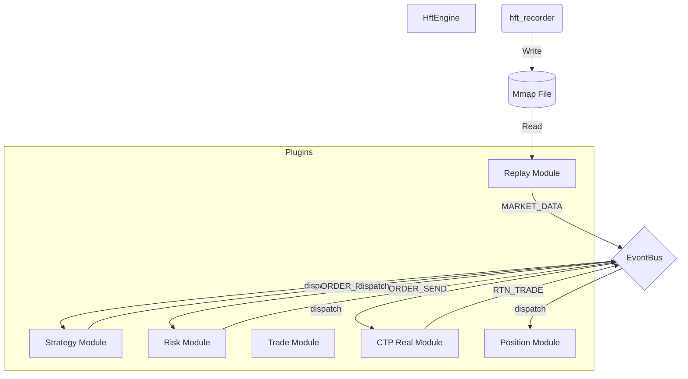

# HFT Event-Based System (hft_eb)

## 简介
`hft_eb` 是一个基于事件驱动架构（Event-Driven Architecture）的高频交易系统核心引擎。旨在提供极致的低延迟、高吞吐量和模块化扩展能力。

## 核心设计哲学
- **Zero Copy (零拷贝)**: 事件在总线上传递时仅传递指针，杜绝不必要的内存拷贝。
- **Lock Free (无锁设计)**: 关键路径（Hot Path）采用单线程同步调用，避免互斥锁竞争。
- **IPC RingBuffer**: 采用 **Mmap + Atomic Cursor** 实现跨进程/跨模块的无锁极低延迟数据传输。
- **Plugin Architecture (插件化)**: 基于动态库（`.so`）的插件系统，支持运行时加载和灵活配置。
- **Risk First (风控优先)**: 风控模块作为交易的强制前置过滤器，确保资金安全。

## 系统架构

### 数据流拓扑


### 核心组件
- **HftEngine**: 负责管理插件生命周期和系统初始化。
- **EventBus**: 同步事件分发核心，连接各个业务模块。
- **Plugins (模块)**:
    - `replay`: 历史数据/实时数据回放模块。
    - `strategy`: 交易策略实现。
    - `risk`: 事前风控模块。
    - `trade` / `ctp_real`: 模拟/实盘交易执行模块。
    - `position`: 实时持仓管理。

### 独立录制器 (hft_md)
位于 `hft_md/` 目录，是一个独立的行情录制进程。
- **功能**: 连接 CTP 行情接口，将 Tick 数据直接写入 Mmap 文件。
- **特性**: Crash-Safe，支持断点续传，为交易引擎提供 Zero Copy 的实时数据源。

## 目录结构
```
hft_eb/
├── bin/                     # 编译产出
├── conf/                    # 配置文件
├── core/                    # 核心库 (IPC, Protocol)
├── data/                    # 行情数据存储 (Mmap)
├── hft_md/                  # 独立行情录制器项目
├── include/                 # 引擎对外接口
├── modules/                 # 业务插件源码
├── src/                     # 引擎源码
├── third_party/             # 第三方依赖 (CTP)
└── build_release.sh         # 构建脚本
```

## 快速开始

### 1. 环境依赖
- Linux OS
- C++17 Compiler (GCC/Clang)
- CMake >= 3.10
- CTP API (已包含在 `third_party/` 中)
- rapidjson

### 2. 编译

**编译主引擎及插件:**
```bash
./build_release.sh
```

**编译行情录制器:**
```bash
cd hft_md
./build.sh
```

### 3. 运行

**运行回测/回放模式:**
确保 `conf/config_replay.json` 配置正确，指向有效的 Mmap 数据文件。
```bash
cd bin
./hft_engine ../conf/config_replay.json
```

**运行行情录制:**
```bash
cd hft_md
./run.sh
```

## 如何开发新插件

系统通过动态库（`.so`）加载机制支持高度灵活的插件扩展。所有插件需实现 `IModule` 接口。

### 1. 继承 IModule 接口

在你的 `.cpp` 文件中包含 `framework.h` 并继承 `IModule` 类：

```cpp
#include "framework.h"

class MyCustomPlugin : public IModule {
public:
    // 初始化：获取 EventBus 指针和配置参数
    void init(EventBus* bus, const ConfigMap& config) override {
        bus_ = bus;
        // 读取配置
        if (config.find("my_param") != config.end()) {
            my_param_ = config.at("my_param");
        }
        
        // 订阅感兴趣的事件
        bus_->subscribe(EVENT_MARKET_DATA, [this](void* data) {
            this->onTick(static_cast<TickRecord*>(data));
        });
    }

    // 处理逻辑
    void onTick(TickRecord* tick) {
        // ... 你的业务逻辑 ...
        
        // 需要发布事件时 (例如发出报单请求)
        // bus_->publish(EVENT_ORDER_REQ, &my_order);
    }

private:
    EventBus* bus_;
    std::string my_param_;
};
```

### 2. 导出插件

在文件末尾使用宏导出插件入口：

```cpp
EXPORT_MODULE(MyCustomPlugin)
```

### 3. 编译构建

在 `CMakeLists.txt` 中添加新的库目标：

```cmake
add_library(mod_my_plugin SHARED modules/my_plugin/my_plugin.cpp)
// 确保输出到 bin 目录
set_target_properties(mod_my_plugin PROPERTIES LIBRARY_OUTPUT_DIRECTORY ${CMAKE_SOURCE_DIR}/bin)
```

### 4. 配置文件

在 `config.json` 的 `plugins` 列表中注册你的插件：

```json
{
  "name": "my_custom_plugin",
  "path": "libmod_my_plugin.so",
  "config": {
    "my_param": "some_value"
  }
}
```
