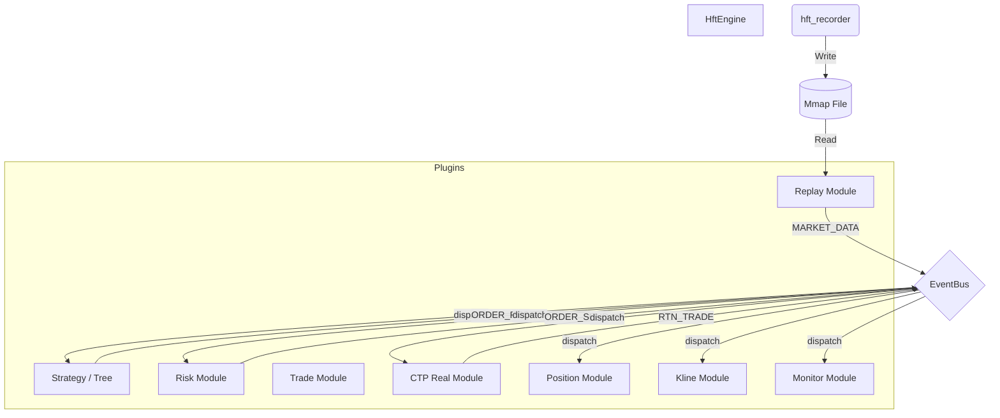

# HFT Event-Based System (hft_eb)

## 简介
`hft_eb` 是一个基于事件驱动架构（Event-Driven Architecture）的高频交易系统核心引擎。目标是提供低延迟、高吞吐、可插拔的交易基础设施，并支持回测、回放、仿真与实盘接入。

## 核心设计哲学
- **Zero Copy (零拷贝)**: 事件在总线上传递时仅传递指针，杜绝不必要的内存拷贝。
- **Lock Free (无锁设计)**: 关键路径采用单线程同步调用，避免互斥锁竞争。
- **IPC RingBuffer**: 采用 **Mmap + Atomic Cursor** 实现跨进程/跨模块的无锁低延迟数据传输。
- **Plugin Architecture (插件化)**: 基于动态库（`.so`）的插件系统，支持运行时加载与灵活配置。
- **Risk First (风控优先)**: 风控模块作为交易前置过滤器，确保资金安全。

## 系统架构

### 数据流拓扑

```mermaid
graph TD
    Engine[HftEngine]
    EventBus{EventBus}
    Recorder(hft_recorder)
    DataFile[(Mmap File)]

    subgraph Plugins
        Replay[Replay Module]
        Strategy[Strategy / Tree]
        Risk[Risk Module]
        Trade[Trade Module]
        CTP_Trade[CTP Real Module]
        PosMgr[Position Module]
        Kline[Kline Module]
        Monitor[Monitor Module]
    end

    Recorder -->|Write| DataFile
    DataFile -->|Read| Replay
    Replay -->|MARKET_DATA| EventBus
    
    EventBus -->|dispatch| Strategy
    Strategy -->|ORDER_REQ| EventBus
    EventBus -->|dispatch| Risk
    Risk -->|ORDER_SEND| EventBus
    EventBus -->|dispatch| CTP_Trade
    CTP_Trade -->|RTN_TRADE| EventBus
    EventBus -->|dispatch| PosMgr
    EventBus -->|dispatch| Kline
    EventBus -->|dispatch| Monitor
```

### 核心组件
- **HftEngine**: 管理插件生命周期、定时器、运行时信号与退出。
- **EventBus**: 同步事件分发，支持 `StaticDelegate` 和 `std::function` 兼容订阅。
- **MarketSnapshot**: 预风控快照，支持 `local` 与 `shm` 两种后端。
- **Plugins (模块)**: 通过配置加载 `.so` 动态库，构建完整交易链路。

## 目录结构
```
hft_eb/
├── bin/                     # 编译产出 (hft_engine + 插件 .so)
├── build/                   # 中间编译目录
├── conf/                    # 配置文件 (.yaml)
├── core/                    # 核心库 (IPC, Protocol, SHM)
├── data/                    # 行情数据存储 (Mmap)
├── docs/                    # 设计文档
├── hft_md/                  # 行情录制器项目 (独立进程)
├── include/                 # 引擎/插件接口
├── modules/                 # 插件源码
├── py_tools/                # Python 工具
├── rust_tools/              # Rust 工具
├── src/                     # 引擎源码
├── tests/                   # 测试与用例
├── third_party/             # 第三方依赖 (CTP)
└── build_release.sh         # 构建脚本
```

## 构建与依赖

### 依赖项
- Linux
- C++17 编译器 (GCC/Clang)
- CMake >= 3.10
- Boost (system)
- OpenSSL
- RapidJSON (头文件)
- yaml-cpp, nlohmann_json
- ixwebsocket, libzmq
- pthread, dl, rt
- CTP API (已包含在 `third_party/ctp/` 中，实盘/行情接入需要)

### 可选依赖
- Apache Arrow + Parquet (用于 `libmod_kline_parquet_replay.so`)
- CCAPI (Binance USDT Futures Trade 插件通过 FetchContent 拉取)

### 编译
```bash
./build_release.sh
```

清理并重建：
```bash
./build_release.sh clean
```

编译完成后输出：
- `bin/hft_engine`
- `bin/lib*.so`

## 快速开始

### 1. 回放 + 策略 + 仿真成交 (示例)
```bash
cd bin
./hft_engine ../conf/config_sim_backtest.yaml
```

### 2. 因子 DAG 示例
```bash
./bin/hft_engine conf/config_factor_dag.yaml
```

### 3. Strategy Tree 并行示例
```bash
./bin/hft_engine conf/config_strategy_tree_parallel_perf_20260320.yaml
```

### 4. Parquet K 线回放 (可选依赖)
```bash
python3 py_tools/gen_symbols_from_parquet.py data/a_share_1d/daily_1d.pq -o conf/symbols_a_share.txt
cd bin
./hft_engine ../conf/config_test_kline_parquet_replay.yaml
```

### 5. 实盘/仿真实盘 (需配置 CTP 账号与库路径)
```bash
./run.sh
```

注意事项：
- `run.sh` 会 `pkill hft_engine` 并使用 `conf/config_real_test.yaml`。
- 实盘相关配置包含账号与密码，请勿提交敏感信息。
- 需要确保 `LD_LIBRARY_PATH` 包含 `third_party/ctp/lib` 与 `bin`。

## 配置说明

引擎使用 YAML 配置文件（建议显式传入路径，默认 `config.json` 并不常用）。

顶层字段：
- `symbols_file`: 全局品种映射，默认 `conf/symbols.txt`。
- `snapshot`: 预风控快照配置。
- `trading_hours`: 运行时间窗。
- `plugins`: 插件数组，按顺序加载。

`snapshot` 结构：
- `type`: `local` 或 `shm`。
- `path`: 共享内存路径，默认 `/hft_snapshot`。
- `is_writer`: 是否写入方。

`plugins` 结构：
- `name`: 模块名称。
- `library`: `.so` 路径。
- `enabled`: 是否启用，默认 `true`。
- `config`: 模块配置。
- `library` 路径按当前运行目录解析，请与启动命令保持一致。

配置传入机制（来自 `src/engine.cpp`）：
- `config` 中的 **标量字段** 会被扁平化为 `ConfigMap`。
- 同时注入 `_yaml` 字段，包含完整 YAML 字符串（适合复杂模块自行解析）。

配置示例：
```yaml
symbols_file: "../conf/symbols.txt"

snapshot:
  type: "local"

plugins:
  - name: Replay
    library: "libmod_replay.so"
    enabled: true
    config:
      data_file: "data/market_data_20260319_night"

  - name: Risk
    library: "libmod_risk.so"
    enabled: true
    config:
      max_orders_per_second: 100
```

插件顺序建议：
- 风控模块应在 `Order_Manager` 之前注册，以便先限频再发单。

## 插件清单 (编译产物)

行情与回放：
- `libmod_ctp.so`
- `libmod_replay.so`
- `libmod_kline.so`
- `libmod_kline_parquet_replay.so` (可选)

交易与执行：
- `libmod_trade.so`
- `libmod_sim_trade.so`
- `libmod_ctp_real.so`
- `libmod_ccapi_binance_usds_trade.so`
- `libmod_sweep_trader.so`

风控与管理：
- `libmod_risk.so`
- `libmod_order.so`
- `libmod_position.so`
- `libmod_account.so`

监控与测试：
- `libmod_monitor.so`
- `libmod_signal_csv.so`
- `libmod_test_harness.so`
- `libmod_plugin_event_tap.so`

策略与策略树：
- `libmod_strategy.so`
- `libmod_strategy_tree.so`
- `libmod_strategy_tree_parallel.so`
- `libstrat_grid.so`
- `libstrat_cs_combiner.so`
- `libstrat_price_jump.so`
- `libstrat_stat_arb.so`
- `libstrat_sma.so`
- `libstrat_imbalance.so`

因子 DAG：
- `libmod_factor_dag.so`
- `libfactor_last_price.so`
- `libfactor_sma.so`
- `libfactor_spread.so`
- `libfactor_imbalance.so`
- `libfactor_volatility.so`
- `libfactor_combiner.so`

核心库：
- `libhft_core.so`

## 开发新插件

插件需实现 `IModule` 接口并导出工厂函数：

```cpp
#include "framework.h"

class MyCustomPlugin : public IModule {
public:
    void init(EventBus* bus, const ConfigMap& config, ITimerService* timer_svc) override {
        bus_ = bus;
        if (config.find("my_param") != config.end()) {
            my_param_ = config.at("my_param");
        }

        bus_->subscribe(EVENT_MARKET_DATA,
            StaticDelegate<void(void*)>::bind<MyCustomPlugin, &MyCustomPlugin::onTick>(this));
    }

    void onTick(void* data) {
        auto* tick = static_cast<TickRecord*>(data);
        (void)tick;
        // ... your logic ...
    }

private:
    EventBus* bus_ = nullptr;
    std::string my_param_;
};

EXPORT_MODULE(MyCustomPlugin)
```

如果是策略树叶子节点，实现 `IStrategyNode` 并导出：
```cpp
EXPORT_STRATEGY(MyStrategyNode)
```

在 `CMakeLists.txt` 中添加新模块目标，并将输出目录设为 `bin/`。

## 行情录制器 (hft_md)

`hft_md` 是独立行情录制进程，连接 CTP 行情接口并将 Tick 写入 Mmap 文件，供 `Replay` 插件回放。

编译：
```bash
cd hft_md
./build.sh
```

运行：
```bash
cd hft_md
./run.sh 20260325
```

说明：
- `run.sh` 默认使用当天日期并写入 `hft_md/conf/config.yaml`。
- 输出目录由 `hft_md/conf/config.yaml` 的 `output_path` 决定，默认 `../data/`。
- 如需共享快照，配置 `shm` 字段（如 `/hft_md_snapshot`）。

## 高级特性

### 策略树 (Strategy Tree)
`StrategyTreeModule` 支持将复杂交易逻辑拆解为多节点流水线，并通过 YAML 动态组合与并行分片。

### 极速行情流 (High-Speed Data Stream)
基于 Mmap 的 `.dat` + `.meta` 结构，支持历史回溯与实时转发。

### 安全监控 (Secure Monitor)
`monitor` 插件提供 WebSocket + ZMQ 控制与鉴权机制。
