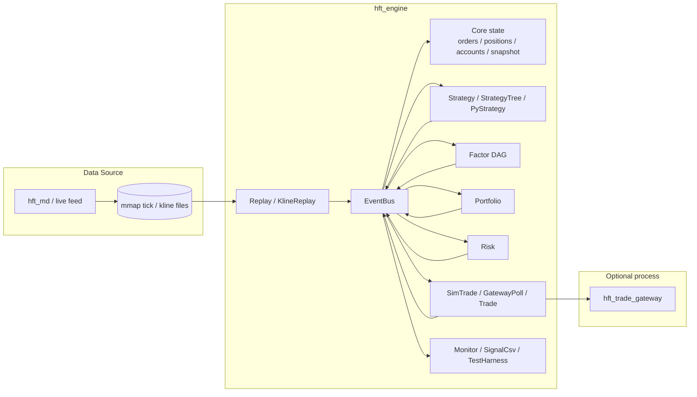

[EN-US](./README.md) | [ZH-CN](./README.zh-CN.md)

# HFT Event-Based System (`hft_eb`)

`hft_eb` is a Linux-first event-driven high-frequency trading framework written in C++17.
It is built around a synchronous in-process event bus, dynamically loaded modules, and a shared core state layer for orders, positions, accounts, and market snapshots.

This README is intentionally optimized for developers who need to:

- understand the project quickly
- build and run it with minimal guesswork
- add or modify modules without reverse-engineering the whole repository

Related docs:

- `docs/README.md`: documentation index
- `docs/modules_overview.md`: module responsibility map
- `docs/plugins/README.md`: plugin parameter index

## What This Repository Contains

The repository provides:

- `hft_engine`: the main host process
- dynamically loaded strategy / factor / risk / trade / replay modules
- `hft_trade_gateway`: a standalone trade gateway process
- `hft_md`: a market data recorder that writes mmap-backed tick files
- Python and Rust helper tools for research and data handling

Typical use cases:

- replay historical market data into strategies
- run simulation trading pipelines
- wire real trading adapters behind a process boundary
- develop strategy tree nodes or factor DAG nodes
- extend the framework with custom modules

## Core Runtime Model

At runtime, `hft_engine` does four things:

1. loads a YAML config
2. initializes shared core services and market snapshot storage
3. `dlopen`s configured module `.so` files in order
4. drives the system by publishing polling events into the event bus

The main event loop in `src/engine.cpp` continuously publishes:

- `EVENT_POLL_GATEWAY`
- `EVENT_POLL_REPLAY`

Modules subscribe to events and publish new ones synchronously through `EventBus`.
That means the execution chain is explicit and easy to extend, but also means module ordering and callback behavior matter.

Typical pipeline:

`Replay / Market Data -> Strategy / Factor -> Portfolio (optional) -> Risk -> Trade -> Core State / Monitor`

## Architecture Overview


```mermaid
flowchart LR
    subgraph Source["Data Source"]
        MD["hft_md / live feed"]
        MMAP[("mmap tick / kline files")]
    end

    subgraph Engine["hft_engine"]
        BUS["EventBus"]
        CORE["Core state<br/>orders / positions / accounts / snapshot"]
        REPLAY["Replay / KlineReplay"]
        STRAT["Strategy / StrategyTree / PyStrategy"]
        FACTOR["Factor DAG"]
        PORT["Portfolio"]
        RISK["Risk"]
        TRADE["SimTrade / GatewayPoll / Trade"]
        MON["Monitor / SignalCsv / TestHarness"]
    end

    subgraph Gateway["Optional process"]
        GW["hft_trade_gateway"]
    end

    MD --> MMAP
    MMAP --> REPLAY
    REPLAY --> BUS
    BUS --> STRAT
    BUS --> FACTOR
    STRAT --> BUS
    FACTOR --> BUS
    BUS --> PORT
    PORT --> BUS
    BUS --> RISK
    RISK --> BUS
    BUS --> TRADE
    TRADE --> BUS
    BUS --> CORE
    BUS --> MON
    TRADE --> GW
```

## Repository Layout

```text
hft_eb/
├── bin/                  # build outputs: executables and shared libraries
├── build/                # CMake build directory
├── conf/                 # YAML configs and symbol lists
├── core/                 # shared core state, snapshot, protocol, IPC primitives
├── docs/                 # architecture and module docs
├── hft_md/               # market data recorder
├── include/              # public engine/module interfaces
├── modules/              # loadable modules
├── py_tools/             # Python utilities
├── rust_tools/           # Rust utilities
├── src/                  # engine host implementation
├── tests/                # tests and experiments
├── third_party/          # bundled dependencies and vendor code
└── trade_gateway/        # standalone trade gateway process
```

## Key Extension Points

### 1. Standard engine module

Modules implement `IModule` from `include/framework.h`:

```cpp
class IModule {
public:
    virtual ~IModule() = default;
    virtual void init(EventBus* bus, const ConfigMap& config, ITimerService* timer_svc = nullptr) = 0;
    virtual void start() {}
    virtual void stop() {}
};
```

Export the factory symbol with:

```cpp
EXPORT_MODULE(MyModule)
```

Use this for:

- replay modules
- risk modules
- trade modules
- monitor modules
- top-level strategy/factor orchestration modules

### 2. Strategy tree leaf node

Strategy tree plugins implement `IStrategyNode` and export:

```cpp
EXPORT_STRATEGY(MyStrategyNode)
```

Use this when you want to add reusable strategy tree leaves instead of a full top-level module.

### 3. Config contract

Engine config is YAML.
For each plugin entry:

- scalar fields inside `config` are flattened into `ConfigMap`
- the full plugin config is also injected as `_yaml`

This is important for secondary development:

- simple modules can read flat scalar strings directly
- complex modules can parse `_yaml` themselves

## Main Build Targets

From the current `CMakeLists.txt`, the important targets are:

Executables:

- `hft_engine`
- `hft_trade_gateway`
- `hft_trade_gateway_ping`
- `hft_recorder`
- `hft_reader`

Core library:

- `libhft_core.so`

Representative module libraries:

- `libmod_replay.so`
- `libmod_kline.so`
- `libmod_strategy.so`
- `libmod_strategy_tree.so`
- `libmod_strategy_tree_parallel.so`
- `libmod_py_strategy.so`
- `libmod_factor_dag.so`
- `libmod_portfolio.so`
- `libmod_risk.so`
- `libmod_trade.so`
- `libmod_sim_trade.so`
- `libmod_gateway_poll.so`
- `libmod_signal_csv.so`
- `libmod_test_harness.so`
- `libmod_event_sampler.so`
- `libmod_sweep_trader.so`

Optional target:

- `libmod_kline_parquet_replay.so` when Arrow / Parquet dependencies are available

## Build Requirements

Required:

- Linux
- CMake `>= 3.10`
- C++17 compiler
- `pthread`
- `dl`
- `rt`
- Python 3 development headers

Bundled in `third_party/` and built from source by CMake:

- `yaml-cpp`
- `nlohmann_json`
- `spdlog`
- `abseil-cpp`
- `libzmq`

Environment-specific:

- CTP headers and libraries are expected under `third_party/ctp/`
- some live-trading workflows require correct runtime library paths

Optional:

- Apache Arrow / Parquet support for parquet replay modules

## Build

Recommended build:

```bash
./build_release.sh
```

Clean rebuild:

```bash
./build_release.sh clean
```

What the script does:

- creates `build/` and `bin/`
- unsets common library path variables to avoid accidental linkage pollution
- runs CMake in Release mode
- builds with `make -j$(nproc)`

Expected outputs:

- `bin/hft_engine`
- `bin/hft_trade_gateway`
- `bin/lib*.so`

## Quick Start

### 1. Simulation / backtest pipeline

```bash
cd bin
./hft_engine ../conf/config_sim_backtest.yaml
```

### 2. Factor DAG example

```bash
./bin/hft_engine conf/config_factor_dag.yaml
```

### 3. Parallel strategy tree example

```bash
./bin/hft_engine conf/config_strategy_tree_parallel_perf_20260320.yaml
```

### 4. Python strategy / research examples

Examples exist in:

- `conf/config_py_backtest.yaml`
- `conf/config_py_stock_mf_backtest.yaml`
- `conf/config_py_stock_cs_mf_backtest.yaml`

### 5. Standalone trade gateway

```bash
./bin/hft_trade_gateway --config conf/trade_gateway_demo.yaml
```

### 6. Market data recorder

```bash
cd hft_md
./build.sh
./run.sh 20260325
```

## Runtime Notes That Matter

- Pass an explicit YAML config path whenever possible. `src/main.cpp` still defaults to `config.json`, but normal project usage is YAML-based.
- Plugin library paths are resolved from the current working directory because the engine directly `dlopen`s the configured `library` path.
- If your config uses bare names like `libmod_xxx.so`, running from `bin/` is the safest choice.
- `run.sh` starts `bin/hft_engine` with `conf/config_real_test.yaml` and uses `pkill hft_engine` first. Review it before using it in shared environments.
- Live trading configs may include credentials or sensitive endpoints. Keep those out of commits.

## Config Shape

Top-level fields commonly used by the engine:

- `symbols_file`: symbol mapping file, defaults to `conf/symbols.txt`
- `snapshot`: snapshot backend config
- `trading_hours`: optional runtime window
- `plugins`: ordered plugin list

Snapshot fields:

- `type`: `local` or `shm`
- `path`: shared memory path when `type: shm`
- `is_writer`: writer/reader mode

Plugin fields:

- `name`: human-readable module name
- `library`: shared library path
- `enabled`: optional, defaults to `true`
- `config`: module-specific config

Minimal example:

```yaml
symbols_file: "../conf/symbols.txt"

snapshot:
  type: "local"

plugins:
  - name: Replay
    library: "libmod_replay.so"
    enabled: true
    config:
      data_file: "data/market_data_20260319_night"

  - name: Risk
    library: "libmod_risk.so"
    enabled: true
    config:
      max_orders_per_second: 100
```

Recommended plugin order:

- `Replay / market data`
- `Strategy / Factor`
- `Portfolio` if you aggregate signals before order generation
- `Risk`
- `Trade`
- `Monitor / output`

## Secondary Development Guide

If you are onboarding to the codebase, use this order:

1. read `include/framework.h`
2. read `src/engine.cpp`
3. inspect one config in `conf/`
4. inspect one simple module and one complex module

Suggested starting files:

- `include/framework.h`
- `src/engine.cpp`
- `modules/replay/replay_module.cpp`
- `modules/risk/risk_module.cpp`
- `modules/strategy/simple_strategy.cpp`
- `modules/factor/factor_dag_module.cpp`
- `modules/trade/sim_trade_module.cpp`

When adding a new module:

1. implement `IModule`
2. export it with `EXPORT_MODULE`
3. add a CMake target
4. place the output in `bin/`
5. register it from a YAML config
6. run with a narrow config first

When adding a strategy tree node:

1. implement `IStrategyNode`
2. export it with `EXPORT_STRATEGY`
3. add a dedicated shared library target
4. load it through the strategy tree module config

## Developer Workflow Tips

- Keep module responsibilities narrow. The framework already gives you event dispatch, timer registration, and config injection.
- Prefer validating new logic in replay or sim-trade mode before touching live paths.
- Reuse existing configs in `conf/` as templates instead of starting from scratch.
- For plugin parameter details, use `docs/plugins/README.md`.
- For architecture decisions and boundaries, use `docs/README.md`.

## Helper Tooling

Python tools:

- data prep and research helpers in `py_tools/`

Rust tools:

- `rust_tools/` contains `hft_reader`, with helpers around mmap/parquet workflows

These tools are not required to build the main engine, but they are useful for research and data-side development.

## Where To Look Next

- New developer onboarding: `docs/README.md`
- Module-level responsibility map: `docs/modules_overview.md`
- Plugin config lookup: `docs/plugins/README.md`
- Trade gateway internals: `trade_gateway/`
- Market data recorder internals: `hft_md/`
