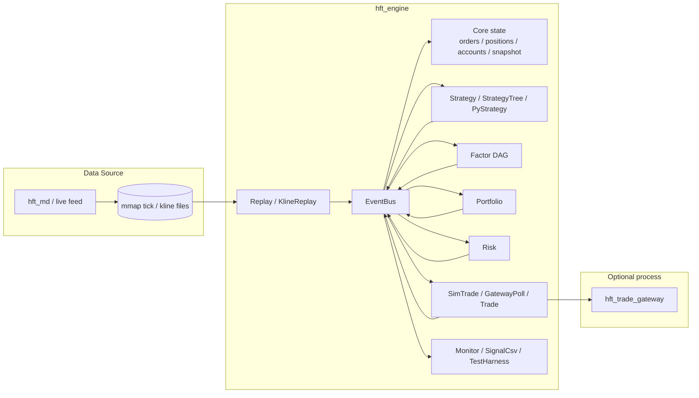

[EN-US](./README.md) | [ZH-CN](./README.zh-CN.md)

# HFT Event-Based System (`hft_eb`)

`hft_eb` 是一个 Linux 优先、基于事件驱动架构的 C++17 高频交易框架。
它的核心由同步进程内事件总线、动态加载模块，以及订单、持仓、账户、行情快照等共享核心状态组成。

这份文档面向需要快速进入项目的开发者，重点解决三件事：

- 快速理解项目结构
- 快速完成构建和运行
- 快速进行二次开发，而不是先把整个仓库读完

相关文档入口：

- `docs/README.md`：文档总索引
- `docs/modules_overview.md`：模块职责概览
- `docs/plugins/README.md`：插件参数索引

## 仓库提供了什么

这个仓库主要包括：

- `hft_engine`：主宿主进程
- 策略 / 因子 / 风控 / 交易 / 回放等动态模块
- `hft_trade_gateway`：独立交易网关进程
- `hft_md`：将 Tick 写入 mmap 文件的行情录制器
- Python 与 Rust 辅助工具

典型使用场景：

- 回放历史行情驱动策略
- 跑仿真交易链路
- 将真实交易适配层隔离到独立进程
- 开发策略树节点或因子 DAG 节点
- 扩展自定义模块

## 运行时模型

`hft_engine` 启动后主要做四件事：

1. 读取 YAML 配置
2. 初始化共享核心状态和行情快照
3. 按顺序 `dlopen` 配置中的模块 `.so`
4. 通过事件总线持续驱动系统运行

`src/engine.cpp` 中的主循环会持续发布：

- `EVENT_POLL_GATEWAY`
- `EVENT_POLL_REPLAY`

各模块通过 `EventBus` 同步订阅和发布事件。
这让执行链路直观、容易扩展，但也意味着模块顺序和回调行为都很关键。

典型链路：

`Replay / 行情 -> Strategy / Factor -> Portfolio(可选) -> Risk -> Trade -> Core State / Monitor`

## 架构概览



## 目录结构

```text
hft_eb/
├── bin/                  # 构建产物：可执行文件和共享库
├── build/                # CMake 构建目录
├── conf/                 # YAML 配置和 symbols 文件
├── core/                 # 核心状态、快照、协议、IPC 基础设施
├── docs/                 # 架构与模块文档
├── hft_md/               # 行情录制器
├── include/              # 引擎/模块公共接口
├── modules/              # 可加载模块
├── py_tools/             # Python 工具
├── rust_tools/           # Rust 工具
├── src/                  # 引擎宿主实现
├── tests/                # 测试与实验代码
├── third_party/          # 内置第三方依赖
└── trade_gateway/        # 独立交易网关进程
```

## 主要扩展点

### 1. 普通引擎模块

模块实现 `include/framework.h` 中的 `IModule`：

```cpp
class IModule {
public:
    virtual ~IModule() = default;
    virtual void init(EventBus* bus, const ConfigMap& config, ITimerService* timer_svc = nullptr) = 0;
    virtual void start() {}
    virtual void stop() {}
};
```

通过下面的宏导出工厂符号：

```cpp
EXPORT_MODULE(MyModule)
```

适用场景：

- 回放模块
- 风控模块
- 交易模块
- 监控模块
- 顶层策略 / 因子编排模块

### 2. 策略树叶子节点

策略树插件实现 `IStrategyNode`，并导出：

```cpp
EXPORT_STRATEGY(MyStrategyNode)
```

当你要新增可复用的策略树叶子节点，而不是完整顶层模块时，使用这种方式。

### 3. 配置注入约定

引擎配置使用 YAML。
对每个插件项来说：

- `config` 内的标量字段会被扁平化进 `ConfigMap`
- 完整插件配置还会以 `_yaml` 注入

这对二次开发很重要：

- 简单模块可以直接读取扁平字符串参数
- 复杂模块可以自行解析 `_yaml`

## 主要构建目标

按当前 `CMakeLists.txt`，重点目标包括：

可执行文件：

- `hft_engine`
- `hft_trade_gateway`
- `hft_trade_gateway_ping`
- `hft_recorder`
- `hft_reader`

核心库：

- `libhft_core.so`

代表性模块库：

- `libmod_replay.so`
- `libmod_kline.so`
- `libmod_strategy.so`
- `libmod_strategy_tree.so`
- `libmod_strategy_tree_parallel.so`
- `libmod_py_strategy.so`
- `libmod_factor_dag.so`
- `libmod_portfolio.so`
- `libmod_risk.so`
- `libmod_trade.so`
- `libmod_sim_trade.so`
- `libmod_gateway_poll.so`
- `libmod_signal_csv.so`
- `libmod_test_harness.so`
- `libmod_event_sampler.so`
- `libmod_sweep_trader.so`

可选目标：

- `libmod_kline_parquet_replay.so`，需要 Arrow / Parquet 相关依赖

## 构建要求

必需：

- Linux
- CMake `>= 3.10`
- C++17 编译器
- `pthread`
- `dl`
- `rt`
- Python 3 开发头文件

由 CMake 从 `third_party/` 内置源码构建：

- `yaml-cpp`
- `nlohmann_json`
- `spdlog`
- `abseil-cpp`
- `libzmq`

环境相关：

- CTP 头文件和库预期位于 `third_party/ctp/`
- 某些实盘路径需要正确的运行时库路径

可选：

- 用于 parquet 回放模块的 Apache Arrow / Parquet 支持

## 构建

推荐方式：

```bash
./build_release.sh
```

清理后重建：

```bash
./build_release.sh clean
```

脚本会做这些事：

- 创建 `build/` 和 `bin/`
- 清理常见库路径环境变量，避免错误链接
- 用 Release 模式执行 CMake
- 使用 `make -j$(nproc)` 编译

预期产物：

- `bin/hft_engine`
- `bin/hft_trade_gateway`
- `bin/lib*.so`

## 快速开始

### 1. 仿真 / 回测链路

```bash
cd bin
./hft_engine ../conf/config_sim_backtest.yaml
```

### 2. 因子 DAG 示例

```bash
./bin/hft_engine conf/config_factor_dag.yaml
```

### 3. 并行策略树示例

```bash
./bin/hft_engine conf/config_strategy_tree_parallel_perf_20260320.yaml
```

### 4. Python 策略 / 研究示例

可参考：

- `conf/config_py_backtest.yaml`
- `conf/config_py_stock_mf_backtest.yaml`
- `conf/config_py_stock_cs_mf_backtest.yaml`

### 5. 独立交易网关

```bash
./bin/hft_trade_gateway --config conf/trade_gateway_demo.yaml
```

### 6. 行情录制器

```bash
cd hft_md
./build.sh
./run.sh 20260325
```

## 运行时注意事项

- 尽量显式传入 YAML 配置路径。`src/main.cpp` 仍保留 `config.json` 默认值，但项目正常使用已经是 YAML 驱动。
- 插件库路径按当前工作目录解析，因为引擎直接对配置中的 `library` 做 `dlopen`。
- 如果配置里写的是 `libmod_xxx.so` 这样的裸名字，从 `bin/` 目录启动最稳妥。
- `run.sh` 会先 `pkill hft_engine`，再用 `conf/config_real_test.yaml` 启动，使用前应先确认环境。
- 实盘配置可能包含账户、密码或敏感地址，不要提交到仓库。

## 配置结构

引擎常用顶层字段：

- `symbols_file`：symbol 映射文件，默认 `conf/symbols.txt`
- `snapshot`：快照后端配置
- `trading_hours`：可选运行时间窗
- `plugins`：有序插件列表

快照字段：

- `type`：`local` 或 `shm`
- `path`：当 `type: shm` 时的共享内存路径
- `is_writer`：写入方 / 读取方模式

插件字段：

- `name`：模块名称
- `library`：共享库路径
- `enabled`：可选，默认 `true`
- `config`：模块配置

最小示例：

```yaml
symbols_file: "../conf/symbols.txt"

snapshot:
  type: "local"

plugins:
  - name: Replay
    library: "libmod_replay.so"
    enabled: true
    config:
      data_file: "data/market_data_20260319_night"

  - name: Risk
    library: "libmod_risk.so"
    enabled: true
    config:
      max_orders_per_second: 100
```

推荐插件顺序：

- `Replay / market data`
- `Strategy / Factor`
- `Portfolio`，当你需要先聚合信号再下单时
- `Risk`
- `Trade`
- `Monitor / output`

## 二次开发指南

如果你刚接手这个仓库，建议按这个顺序进入：

1. 先读 `include/framework.h`
2. 再读 `src/engine.cpp`
3. 看 `conf/` 下一个真实配置
4. 各挑一个简单模块和复杂模块阅读

建议先看的文件：

- `include/framework.h`
- `src/engine.cpp`
- `modules/replay/replay_module.cpp`
- `modules/risk/risk_module.cpp`
- `modules/strategy/simple_strategy.cpp`
- `modules/factor/factor_dag_module.cpp`
- `modules/trade/sim_trade_module.cpp`

新增普通模块时：

1. 实现 `IModule`
2. 用 `EXPORT_MODULE` 导出
3. 在 CMake 中新增目标
4. 让产物进入 `bin/`
5. 在 YAML 中注册模块
6. 先用最小配置验证

新增策略树节点时：

1. 实现 `IStrategyNode`
2. 用 `EXPORT_STRATEGY` 导出
3. 新增独立共享库目标
4. 通过策略树模块配置加载

## 开发建议

- 保持模块职责单一。框架已经提供了事件派发、定时器注册和配置注入。
- 新逻辑优先在 replay 或 sim-trade 模式验证，再碰实盘路径。
- 先复用 `conf/` 里的现有配置模板，不要从零开始拼。
- 查看插件参数时优先读 `docs/plugins/README.md`。
- 查看架构边界和设计决策时优先读 `docs/README.md`。

## 辅助工具

Python 工具：

- `py_tools/` 中的数据处理和研究辅助脚本

Rust 工具：

- `rust_tools/` 中包含 `hft_reader`，用于 mmap / parquet 相关数据处理

这些工具不是主引擎构建必需项，但对研究和数据侧开发有帮助。

## 下一步看哪里

- 新人入口：`docs/README.md`
- 模块职责地图：`docs/modules_overview.md`
- 插件配置查询：`docs/plugins/README.md`
- 交易网关细节：`trade_gateway/`
- 行情录制器细节：`hft_md/`
