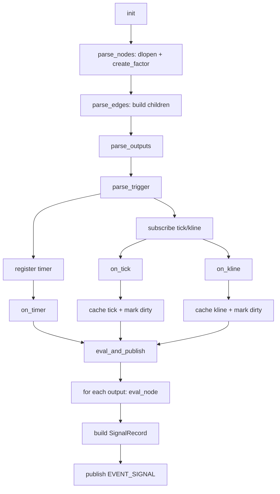

# DAG 模块设计 (FactorDAGModule)

## 1. 概述
FactorDAGModule 是因子计算模块的 DAG 执行引擎。它从 YAML 配置加载因子节点与依赖关系，
在 Tick/Kline/定时器触发下递归计算并发布信号（EVENT_SIGNAL）。

## 2. 配置要点
- `nodes`: 因子节点列表（`id` + `library` + `params`）
- `edges`: DAG 依赖关系（`from` -> `to`，`to` 依赖 `from`）
- `outputs`: 输出映射（输出节点与 `factor_name`）
- `trigger`: 触发配置（`on_tick` / `on_kline` / `on_timer`）

## 3. 运行逻辑
1. `init()` 读取 YAML  
2. `parse_nodes` 动态加载因子节点（`dlopen` + `create_factor`）  
3. `parse_edges` 构建依赖关系（子节点挂到父节点的 `children`）  
4. `parse_outputs` 配置输出映射  
5. `parse_trigger` 注册 Tick/Kline/Timer 触发  
6. 触发后 `eval_and_publish` 递归计算并发布 `EVENT_SIGNAL`

## 4. 触发与计算细节
- `on_tick`：缓存最新 Tick、标记相关节点 dirty，若 `trigger.on_tick=true` 则立即计算与发布  
- `on_kline`：缓存最新 Kline、标记相关节点 dirty，若 `trigger.on_kline=true` 则立即计算与发布  
- `on_timer`：定时触发计算与发布  
- `eval_node`：递归计算子节点 → 组装 `FactorContext` → 调用 `IFactorNode::compute`  
- `publish_signal`：构造 `SignalRecord` 并通过 EventBus 发布 `EVENT_SIGNAL`

## 5. 流程图

## 6. 关键实现位置
- `modules/factor/factor_dag_module.cpp`

## 7. 后续计划
- 基础因子：支持基于 Tick 的实时更新与缓存（逐 Tick 更新内部状态）
- 定时触发：按固定周期触发截面计算（因子或组合节点）
- 截面计算：支持在定时触发时对全量品种进行批量评估与输出
