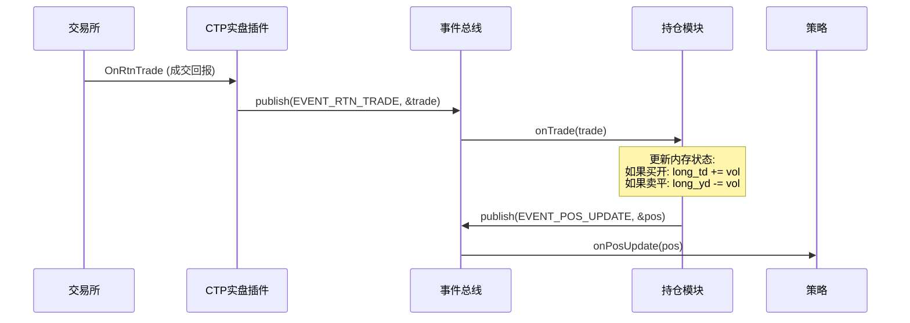

# 持仓管理系统设计文档 (Position Management System)

## 1. 核心概念
持仓模块 (PositionModule) 是无状态策略系统的状态容器。它的核心任务是通过监听总线上的“成交”事件来实时计算当前的持仓状态，并为策略提供“我可以卖/平多少手”的准确信息。

对于中国期货市场（特别是上期所），必须严格区分**今仓 (Today)** 和**昨仓 (Yesterday/History)**。

## 2. 事件协议扩展 (Protocol Extensions)
我们需要扩充 `framework.h` 来支持交易回执。

### 新增事件类型
- `EVENT_RTN_ORDER`: 交易所返回的委托状态变化（报单成功、撤单成功、错单等）。
- `EVENT_RTN_TRADE`: 交易所返回的真实成交记录。
- `EVENT_POS_UPDATE`: 持仓模块计算后发布的持仓变更事件。

### 数据结构
```cpp
// 委托回报
struct OrderRtn {
    char order_ref[13];
    char symbol[32];
    char direction;      // 'B'uy / 'S'ell
    char offset_flag;    // 'O'pen, 'C'lose, 'T'oday (平今)
    double limit_price;
    int volume_total;    // 原始报单量
    int volume_traded;   // 已成交量
    char status;         // '0':全部成交, '1':部分成交, '3':未成交, '5':已撤单
    char status_msg[81];
};

// 成交回报
struct TradeRtn {
    char symbol[32];
    char direction;      // 'B'/'S' (注意：配合开平标志判断多空方向)
    char offset_flag;    // 'O'/'C'/'T'
    double price;
    int volume;
    char trade_id[21];
    char order_ref[13];
};

// 持仓明细 (每合约一个对象)
struct PositionDetail {
    char symbol[32];
    
    // 多头 (Long)
    int long_td;      // 今仓
    int long_yd;      // 昨仓 (可平量)
    double long_avg_price; // 持仓均价
    
    // 空头 (Short)
    int short_td;
    int short_yd;
    double short_avg_price;
    
    // 聚合数据
    double net_pnl;   // 浮动盈亏 (需要最新行情计算)
};
```

## 3. 架构与数据流



## 4. 实现逻辑 (PositionModule.cpp)


### 状态管理

使用 `std::unordered_map<std::string, PositionDetail> positions_;` 存储所有合约持仓。使用 `std::mutex` 确保线程安全。


### 处理规则 (当前简化版)

- **买开 (Buy Open)**: `long_td += volume`。

- **卖开 (Sell Open)**: `short_td += volume`。

- **卖平 (Sell Close)**: 

  - 如果 `OffsetFlag == 'T'` (平今)，扣减 `long_td`。

  - 否则，优先扣减 `long_yd`，不足部分扣减 `long_td`。

- **买平 (Buy Close)**: 

  - 如果 `OffsetFlag == 'T'` (平今)，扣减 `short_td`。

  - 否则，优先扣减 `short_yd`，不足部分扣减 `short_td`。


### 限制

- 当前版本尚未实现平均成交价计算及盈亏 (PnL) 统计。

- 尚未处理 `EVENT_RTN_ORDER` 事件。
