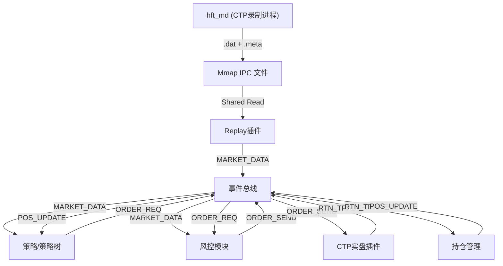

# HFT 系统开发路线图 (Roadmap)

## 第一阶段：核心基础设施 (已完成)
- [x] **事件总线 (EventBus)**: 零拷贝、同步事件分发机制。
- [x] **插件架构 (Plugin Architecture)**: 支持 `.so` 动态加载及生命周期管理 (`init`, `start`, `stop`)。
- [x] **协议定义 (`framework.h`)**:
    - `EVENT_MARKET_DATA` (行情数据)
    - `EVENT_ORDER_REQ` (策略交易意图)
    - `EVENT_ORDER_SEND` (经风控批准的指令)
    - `EVENT_RTN_ORDER` / `EVENT_RTN_TRADE` (交易所状态与成交回报)
- [x] **IPC 链路**: 基于 Mmap 的跨进程行情传输机制实现。

## 第二阶段：核心业务模块 (进行中)

### 0. 极速行情链路 (High-Speed Data Stream) - (已完成)
- [x] **行情录制 (hft_md)**: 独立进程，基于 `RingBuffer` 将实时行情无锁写入 `mmap` 文件。
- [x] **数据回放插件 (Replay Module)**: 提供统一的 `mmap` 读取接口，实现进程间数据极速共享。

### 0.5 实盘交易与持仓 (Trade & Position) - (进行中)
- [x] **CTP 实盘插件 (ctp_real)**: 对接 CTP 柜台，支持报单、撤单及成交回报。
- [x] **简单交易模拟 (trade)**: 用于离线测试的交易仿真模块。
- [ ] **持仓账本 (Position Mgr)**: 
    - [x] 监听 `EVENT_RTN_TRADE`。
    - [ ] 实时计算多空持仓（区分今仓、昨仓）。
    - [ ] 为策略提供持仓查询接口，实现“平仓”逻辑的正确性。

### 1. 因子化与策略树 (Factor & Strategy Tree) - 优先级：最高
- [ ] **K线生成引擎 (K-Line Engine)**: 将原始 Tick 流实时整理为多周期数据。
- [ ] **因子计算插件 (Factor Plugins)**: 将计算逻辑插件化，支持动态加载。
- [ ] **策略树容器 (Strategy Tree)**: 二级插件架构，支持多策略组合管理。

### 2. 系统监控与 UI (Monitor & UI) - 优先级：高
- [x] **监控插件 (monitor)**: 基础心跳与状态输出。
- [ ] **数据网关 (ZMQ Gateway)**: C++ 引擎与 Web 前端之间的异步桥梁。
- [ ] **功能**:
    - 实时广播行情快照。
    - 监控账户实时盈亏 (PnL) 与持仓状态。

## 第三阶段：高级交易逻辑 (计划中)

### 3. 系统监控 (Watchdog)
- [ ] **角色**: 系统稳定性。
- [ ] **功能**:
    - 监控模块心跳。
    - 异常崩溃报警。

## 架构数据流向图

