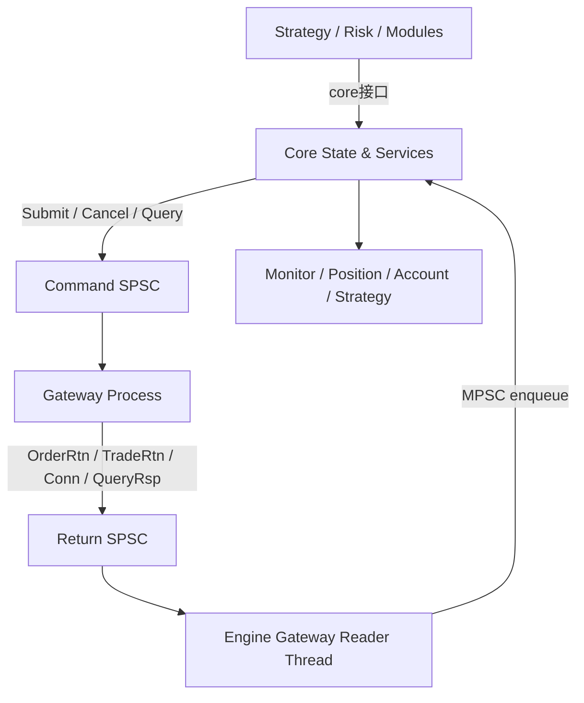

# 交易网关进程化设计

## 1. 背景与问题

当前系统的实盘柜台以进程内插件方式接入主引擎。这个模式在早期联调和单账户场景中比较直接，但在多账户实盘与长期演进下会暴露几个问题：

- 柜台 SDK 的线程模型、回调线程、重连状态机进入主引擎地址空间，污染主进程线程边界。
- 柜台异常、阻塞、第三方库崩溃会直接影响主引擎稳定性。
- 多账户柜台共享同一进程，故障域和运维边界不清晰。
- 订单、持仓、连接状态已经开始向 `core` 收口，但柜台仍以内嵌插件方式存在，架构层次不一致。

因此，需要把交易柜台从“进程内插件”演进为“独立 gateway 进程”，将执行面和状态面拆开。

## 2. 设计目标

- 每个 gateway 进程独立运行，隔离柜台 SDK 与主引擎线程模型。
- 主引擎与 gateway 通过两条单向 SPSC 共享内存通道通信。
- `core` 继续作为订单、持仓、账户状态的唯一真相源。
- 下单、撤单、查询统一走 `engine -> gateway` 命令通道。
- 柜台回报、连接状态、查询结果统一走 `gateway -> engine` 回报通道。
- 引擎侧由专门线程消费回报，再投递到 `core` 的 MPSC，由 `core` 单点更新状态。

## 3. 总体架构

### 3.1 主引擎内职责

- 主线程或业务线程调用 `core` 接口提交命令。
- `core` 负责生成 `client_id` 和 `order_ref`，更新本地初始状态。
- gateway client 将命令写入对应 gateway 的命令 SPSC。
- gateway reader 线程消费回报 SPSC，并将事件投递到 `core` 的 MPSC。
- `core` 工作线程统一应用订单、成交、持仓、资金、连接状态更新。

### 3.2 gateway 进程内职责

- 命令消费线程读取命令 SPSC。
- 按命令类型调用柜台 API 执行下单、撤单、查询。
- 柜台回调线程将标准化后的回报写入回报 SPSC。
- 登录、鉴权、重连、查单、查持仓、查资金都在 gateway 内完成。

## 4. 通信模型

每个 gateway 独享一对 SPSC：

- `cmd_ring_<gateway_id>`：主引擎写，gateway 读。
- `rtn_ring_<gateway_id>`：gateway 写，主引擎读。

不采用全局共享通道，原因：

- 降低路由复杂度。
- 明确故障域。
- 多 gateway 并存时更易排障与观测。

### 4.1 命令通道消息

建议统一为固定头 + 载荷：

- `SubmitOrder`
- `CancelOrder`
- `QueryPosition`
- `QueryAccount`
- `QueryOpenOrders`
- 可选 `Heartbeat`

最小公共头字段：

- `msg_type`
- `gateway_id`
- `account_id`
- `request_ts`

`SubmitOrder` 额外字段：

- `client_id`
- `order_ref`
- `symbol`
- `direction`
- `offset_flag`
- `price`
- `volume`

### 4.2 回报通道消息

建议统一为固定头 + 载荷：

- `OrderRtn`
- `TradeRtn`
- `PositionRsp`
- `AccountRsp`
- `ConnectionStatus`
- `GatewayError`
- 可选 `HeartbeatAck`

要求：

- 每条回报带 `gateway_id`
- 尽量携带 `order_sys_id`，若尚未生成则至少带 `order_ref`
- 回报必须允许 `core` 幂等处理

## 5. 状态归属与边界

### 5.1 `core` 负责的内容

- `client_id` 生成
- `order_ref` 生成
- `client_id <-> order_ref <-> order_sys_id` 映射
- 订单生命周期状态机
- 持仓、资金、连接状态主视图
- 是否允许新单进入执行链的判定

### 5.2 gateway 负责的内容

- 柜台连接、鉴权、登录、断线重连
- 报单、撤单、查询的实际执行
- 柜台原始回报标准化
- 重启后的柜台查询回补

### 5.3 明确不放入 gateway 的内容

- 风控决策
- OMS 主状态机
- 订单真相状态双写
- 策略逻辑

## 6. 关键行为约定

### 6.1 下单路径

1. 策略或模块调用 `core.submit_order(...)`
2. `core` 做本地校验并生成 `client_id`、`order_ref`
3. `core` 先写入本地初始订单状态
4. gateway client 将 `SubmitOrder` 写入命令 SPSC
5. gateway 消费命令并调用柜台 API
6. 柜台回调线程写入 `OrderRtn` / `TradeRtn`
7. 引擎 reader 线程读取后投递到 `core` 的 MPSC
8. `core` 统一更新状态并触发后续模块消费

### 6.2 撤单路径

1. 业务侧调用 `core.cancel_order(...)`
2. `core` 根据 `client_id` 查出 `order_ref` / `order_sys_id`
3. gateway client 写入 `CancelOrder`
4. gateway 执行撤单并回灌 `OrderRtn`
5. `core` 更新订单状态

### 6.3 查询路径

查询与交易命令统一走命令 SPSC：

- 查持仓
- 查资金
- 查在途订单

查询结果统一从回报 SPSC 回灌 `core`，不保留直连柜台对象给主引擎调用。

## 7. 失败与恢复语义

### 7.1 队列满

当 `engine -> gateway` 命令 SPSC 满时：

- `core` 立即拒绝该请求
- 记录本地失败状态或失败事件
- 不阻塞主线程
- 不在 v1 中做隐式重试

### 7.2 gateway 未连接或未登录

- `core` 直接拒绝新下单
- 撤单和查询默认也按未就绪处理
- 是否可交易由 gateway 的 `ConnectionStatus` 驱动

### 7.3 gateway 重启与恢复

- 主引擎将该 gateway 标记为不可交易
- gateway 恢复后执行登录与柜台查询
- 以柜台查询结果为主回补订单、持仓、资金状态
- `core` 用幂等方式吸收回补数据

v1 默认不引入本地 WAL 或持久化重放，先依赖柜台查询恢复。

## 8. 落地迁移步骤

### 第一步：抽出交易 IPC 层

- 定义命令与回报消息结构
- 定义 SPSC ring 的头部、容量、读写协议
- 新增 gateway client / gateway server 抽象

### 第二步：主引擎接入 gateway client

- `core` 暴露统一提交接口
- 发送路径改为写命令 SPSC
- reader 线程改为读回报 SPSC 并投递 `core`

### 第三步：CTP 柜台独立进程化

- 将 `ctp_real` 的柜台适配逻辑迁移到独立 gateway 入口
- 保留标准化回报结构，移除对主进程 EventBus 的直接依赖

### 第四步：移除主进程实盘插件路径

- 实盘配置从“加载插件”改为“注册 gateway”
- 订单与回报链路不再依赖进程内柜台插件

### 第五步：补测试与演练

- 单 gateway 链路
- 多 gateway 并发
- 断连、重启、回补
- 队列满与重复回报

## 9. 与现有文档的关系

- 并发与去中心化共享内存思路：见 [docs/并发架构设计_concurrency_design.md](并发架构设计_concurrency_design.md)
- 订单状态与 ID 设计：见 [docs/订单管理设计_order_manager.md](订单管理设计_order_manager.md)
- 持仓 Core 化与 MPSC/Seqlock：见 [docs/持仓管理设计_position.md](持仓管理设计_position.md)
- 文档总导航：见 [docs/README.md](README.md)

## 10. 后续演进

v1 完成后可继续考虑：

- 增加 WAL 或本地持久化恢复
- 统一 gateway 注册与发现机制
- 将更多柜台类型接入同一套 gateway 抽象
- 把监控、告警、指标采集做成 gateway 级别观测能力

