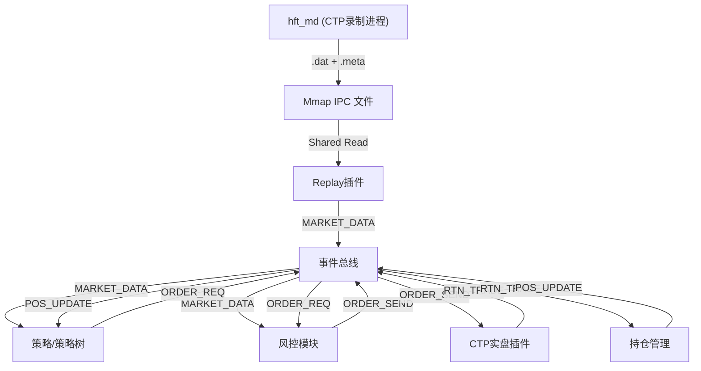

# HFT 系统开发路线图 (Roadmap)

## 第一阶段：核心基础设施 (已完成)
- [x] **事件总线 (EventBus)**: 零拷贝、同步事件分发机制。
- [x] **插件架构 (Plugin Architecture)**: 支持 `.so` 动态加载及生命周期管理 (`init`, `start`, `stop`)。
- [x] **协议定义 (`framework.h`)**:
    - `EVENT_MARKET_DATA` (行情数据)
    - `EVENT_ORDER_REQ` (策略交易意图)
    - `EVENT_ORDER_SEND` (经风控批准的指令)
    - `EVENT_RTN_ORDER` / `EVENT_RTN_TRADE` (交易所状态与成交回报)
- [x] **IPC 链路**: 基于 Mmap 的跨进程行情传输机制实现。

## 第二阶段：核心业务模块 (进行中)

### 0. 极速行情链路 (High-Speed Data Stream) - (已完成)
- [x] **行情录制 (hft_md)**: 独立进程，基于 `RingBuffer` 将实时行情无锁写入 `mmap` 文件。
- [x] **数据回放插件 (Replay Module)**: 提供统一的 `mmap` 读取接口，实现进程间数据极速共享。
- [x] **实时快照 (SHM Snapshot)**: 基于 SeqLock 实现的最新价 O(1) 随机访问，供风控与监控使用。

### 1. 实盘交易与持仓 (Trade & Position) - (进行中)
- [x] **CTP 实盘插件 (ctp_real)**: 对接 CTP 柜台，支持报单、撤单及成交回报。
- [x] **简单交易模拟 (trade)**: 用于离线测试的交易仿真模块。
- [ ] **持仓账本 (Position Mgr)**: 
    - [x] 监听 `EVENT_RTN_TRADE`。
    - [x] 实时基础持仓计算（区分今仓、昨仓）。
    - [ ] 精确均价计算与盈亏 (PnL) 统计。

### 2. 系统监控与 UI (Monitor & UI) - (进行中)
- [x] **监控插件 (monitor)**: 
    - [x] WebSocket & ZMQ 双通道广播。
    - [x] **安全鉴权**: 支持 Header/QueryString 的 Token 校验。
    - [x] **多账户支持**: 协议级多账号隔离设计。
- [ ] **Web 监控面板**: 提供可视化的实时盈亏、持仓、报单管理界面。

### 3. 因子化与策略树 (Factor & Strategy Tree) - 优先级：最高
- [ ] **K线生成引擎 (K-Line Engine)**: 将原始 Tick 流实时整理为多周期数据。
- [ ] **因子计算插件 (Factor Plugins)**: 将计算逻辑插件化，支持动态加载。
- [ ] **策略树容器 (Strategy Tree)**: 二级插件架构，支持多策略组合管理。

## 第三阶段：风控与稳定性 (计划中)

### 4. 交易前风控 (Pre-Trade Risk) - (已完成)
- [x] **流量控制**: 限制每秒最大报单速率，保护柜台连接。
- [ ] **合规检查**: 自成交防护、报撤比监控。

### 5. 系统看门狗 (Watchdog)
- [ ] **角色**: 监控模块心跳与系统稳定性。
- [ ] **功能**: 异常崩溃报警与进程自动拉起。

## 架构数据流向图

