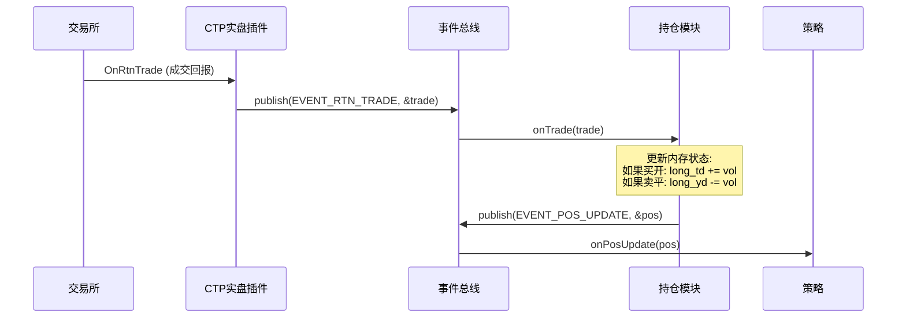

# 持仓管理系统设计文档 (Position Management System)

## 1. 核心概念
持仓模块 (PositionModule) 是无状态策略系统的状态容器。它的核心任务是通过监听总线上的“成交”事件来实时计算当前的持仓状态，并为策略提供“我可以卖/平多少手”的准确信息。

对于中国期货市场（特别是上期所），必须严格区分**今仓 (Today)** 和**昨仓 (Yesterday/History)**。

## 2. 事件协议扩展 (Protocol Extensions)
我们需要扩充 `framework.h` 来支持交易回执。

### 新增事件类型
- `EVENT_RTN_ORDER`: 交易所返回的委托状态变化（报单成功、撤单成功、错单等）。
- `EVENT_RTN_TRADE`: 交易所返回的真实成交记录。
- `EVENT_POS_UPDATE`: 持仓模块计算后发布的持仓变更事件。

### 数据结构
```cpp
// 委托回报
struct OrderRtn {
    char order_ref[13];
    char symbol[32];
    uint64_t symbol_id;  // Hash ID
    char direction;      // 'B'uy / 'S'ell
    char offset_flag;    // 'O'pen, 'C'lose, 'T'oday (平今)
    double limit_price;
    int volume_total;    // 原始报单量
    int volume_traded;   // 已成交量
    char status;         // '0':全部成交, '1':部分成交, '3':未成交, '5':已撤单
    char status_msg[81];
};

// 成交回报
struct TradeRtn {
    char symbol[32];
    uint64_t symbol_id;  // Hash ID
    char direction;      // 'B'/'S' (注意：配合开平标志判断多空方向)
    char offset_flag;    // 'O'/'C'/'T'
    double price;
    int volume;
    char trade_id[21];
    char order_ref[13];
};

// 持仓明细 (每合约一个对象)
struct PositionDetail {
    char symbol[32];
    uint64_t symbol_id;
    
    // 多头 (Long)
    int long_td;      // 今仓
    int long_yd;      // 昨仓 (可平量)
    double long_avg_price; // 持仓均价
    double long_pnl;       // 多头浮动盈亏
    
    // 空头 (Short)
    int short_td;
    int short_yd;
    double short_avg_price;
    double short_pnl;      // 空头浮动盈亏
    
    // 聚合数据
    double net_pnl;   // 总浮动盈亏 (long_pnl + short_pnl)
};
```

## 3. 架构与数据流



## 4. 实现逻辑 (PositionModule.cpp)

### 状态管理
使用 `std::unordered_map<uint64_t, PositionDetail> positions_;` 存储所有合约持仓，Key 为 `Symbol Hash ID` 以提升查找效率。使用 `std::mutex` 确保线程安全。

### 持久化 (Dump)
- 后台线程每秒将持仓状态 Dump 到 `data/pos.json`，用于 GUI 监控或崩溃后的人工核对。

### 处理规则
- **买开 (Buy Open)**: `long_td += volume`。
- **卖开 (Sell Open)**: `short_td += volume`。
- **卖平 (Sell Close)**: 
  - 如果 `OffsetFlag == 'T'` (平今)，扣减 `long_td`。
  - 否则，优先扣减 `long_yd`，不足部分扣减 `long_td`。
- **买平 (Buy Close)**: 
  - 如果 `OffsetFlag == 'T'` (平今)，扣减 `short_td`。
  - 否则，优先扣减 `short_yd`，不足部分扣减 `short_td`。

### 限制
- **均价计算**: 目前仅维护持仓数量，尚未精确计算开仓均价（Open Avg Price）和持仓均价（Holding Avg Price）。
- **盈亏计算**: 需要接入实时行情流 (`EVENT_MARKET_DATA`) 才能动态计算 `net_pnl`。
## 5. 修正方案：Core 化 + 无锁持仓 (MPSC + Seqlock)

### 背景与问题
- `EventBus` 本身非线程安全，但多个模块存在跨线程 `publish`，导致 `PositionModule` 只能用 `std::mutex` 保护 `positions_`。
- 持仓是核心状态，放在模块层会造成跨模块读写时的额外同步与一致性风险。

### 修正目标
- 将持仓“权威状态”下沉到 `core`。
- 写路径无锁、读路径无锁（或近似无锁），仅在极少数冲突时重试。
- 保持现有事件协议 (`EVENT_POS_UPDATE`) 兼容，逐步迁移上层模块。

### 新架构要点
1. **MPSC 写入通道**  
   多生产者线程把更新事件写入 `MPSC RingBuffer`，由单消费者线程串行应用到持仓状态。
2. **Seqlock 读路径**  
   每个持仓槽位使用 `seq` 版本号。读线程无锁读，遇到写中或版本不一致时重试。
3. **PositionModule 退化为适配器**  
   只负责把 `EVENT_RTN_TRADE` / `EVENT_RSP_POS` / `EVENT_CACHE_RESET` 转为 `PositionUpdate` 并入队，  
   不再维护 `positions_` 或 `std::mutex`。

### 关键数据结构 (示意)
```cpp
struct PositionSlot {
    std::atomic<uint64_t> seq{0};
    PositionDetail data;
};

struct PositionUpdate {
    enum Type { Trade, RspPos, Reset } type;
    TradeRtn trade;
    PositionDetail pos;
    CacheReset reset;
};
```

### 核心流程
1. **生产者**：模块线程收到回报后构造 `PositionUpdate`，写入 `MPSC RingBuffer`。  
2. **消费者**：core 内部单线程 `apply(update)`，更新 `PositionSlot`。  
3. **读者**：策略/风控/监控读取 `PositionSlot` 时使用 seqlock 校验。

### Seqlock 读写规则（单写者）
```cpp
// 写入
slot.seq.store(s + 1, std::memory_order_release); // odd 表示写中
slot.data = new_value;
slot.seq.store(s + 2, std::memory_order_release); // even 表示稳定

// 读取
uint64_t s1 = slot.seq.load(std::memory_order_acquire);
if (s1 & 1) retry;
out = slot.data;
uint64_t s2 = slot.seq.load(std::memory_order_acquire);
if (s1 != s2) retry;
```

### 兼容性与迁移
- 仍可发布 `EVENT_POS_UPDATE` 以兼容现有策略与监控模块。
- 逐步将 `PortfolioModule` / `Strategy` 读路径切换到 core 的 `PositionStore`。
- 持久化 (pos.json) 从模块层迁移到 core 的单消费者线程，避免锁竞争。

### 风险与边界
- Seqlock **必须保证单写者**，因此写入需要先做 MPSC 串行化。
- 若需要跨账户/多 symbol 批量快照，建议使用双缓冲快照以减少逐槽重试成本。

## 6. 接口补充 (Core API & Module Adapter)

### 6.1 Core 对外接口 (PositionStore)
```cpp
// 读路径：无锁读
bool get_position(const char* account_id, uint64_t symbol_id, PositionDetail* out) const;

// 快照：用于监控/调试/落盘
void snapshot(std::vector<PositionDetail>* out) const;

// 可选：按账户拉取
void snapshot_account(const char* account_id, std::vector<PositionDetail>* out) const;
```

### 6.2 Core 写入接口 (PositionService)
```cpp
// 生产者接口：多线程可调用（MPSC 入队）
bool enqueue_trade(const TradeRtn& trade);
bool enqueue_rsp_pos(const PositionDetail& pos);
bool enqueue_reset(const CacheReset& reset);

// 消费者线程生命周期
void start();
void stop();
```

### 6.3 Module 适配接口 (PositionModule)
```cpp
// 仅做事件适配，不再维护 positions_ 状态
void onTrade(TradeRtn* rtn);
void onRspPos(PositionDetail* pos);
void onCacheReset(CacheReset* cr);
```

### 6.4 事件兼容 (EventBus)
- `EVENT_POS_UPDATE` 保持不变：由 `PositionService` 写入后统一发布。
- `EVENT_QRY_POS` / `EVENT_RSP_POS` 行为不变：`TradeModule` 继续负责向柜台查询。

### 6.5 错误与降级
- `enqueue_*` 失败时：记录日志并计数，避免阻塞策略线程。
- 如果队列持续满：可触发 `EVENT_LOG` 或报警，提示调大队列容量或提升消费者频率。
