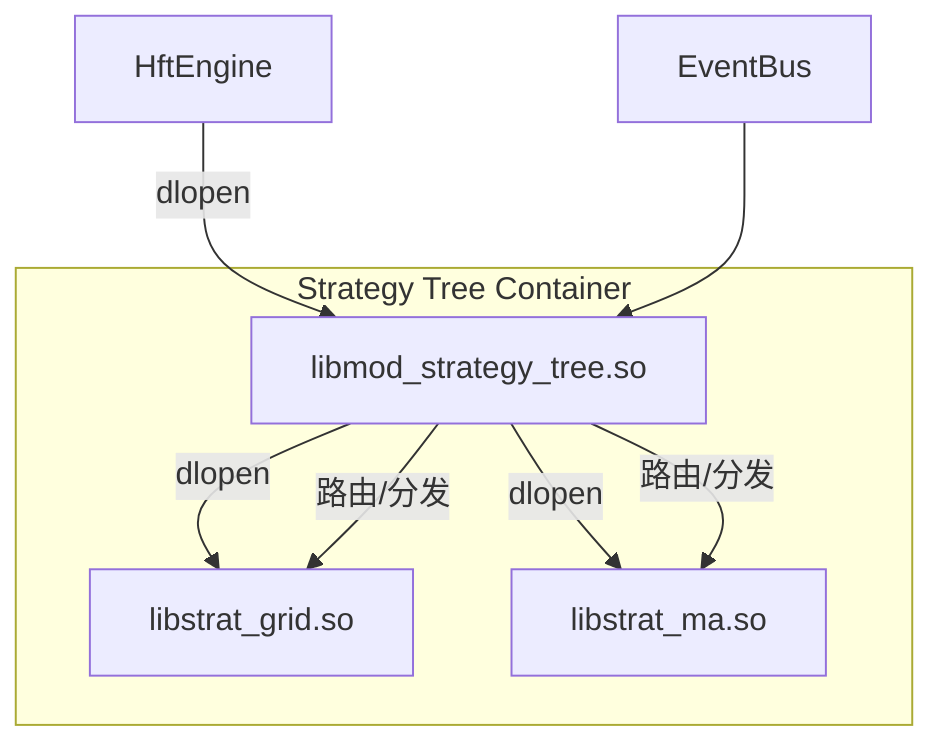

# 策略树设计文档 (Strategy Tree Design)

> **当前状态**：设计阶段 (Planned - 支持插件化叶子节点)

## 1. 核心目标
构建一个层级化的策略管理系统，支持：
- **二级插件化**: 每一个具体的交易策略（叶子节点）都是独立的 `.so` 文件，支持运行时动态加载。
- **资源沙箱**: `StrategyTreeModule` 为每个叶子节点注入受限的上下文（Context），限制其发单权限。
- **极速更新**: 无需重启主引擎，仅通过重载策略插件即可实现逻辑更新。

## 2. 架构模式：二级插件架构



## 3. 接口定义 (C++)

### 3.1 叶子节点接口 (`IStrategyNode`)
这是提供给策略开发者的标准接口。

```cpp
struct StrategyContext {
    std::string strategy_id;
    // 限制性发单函数：内部会自动填充 StrategyID 和 OrderRef 路由信息
    std::function<void(const OrderReq&)> send_order;
    std::function<void(const char* msg)> log;
};

class IStrategyNode {
public:
    virtual ~IStrategyNode() = default;
    virtual void init(StrategyContext* ctx, const ConfigMap& config) = 0;
    virtual void onTick(const TickRecord* tick) = 0;
    virtual void onOrderUpdate(const OrderRtn* rtn) = 0;
};

// 导出宏
#define EXPORT_STRATEGY(CLASS_NAME) \
    extern "C" IStrategyNode* create_strategy() { return new CLASS_NAME(); }
```

### 3.2 容器模块 (`StrategyTreeModule`)
作为 `IModule` 插件，它负责：
1. **动态加载**: 遍历 JSON 配置中的 `library` 路径，使用 `dlopen/dlsym` 实例化各叶子节点。
2. **上下文注入**: 为每个节点创建独立的 `StrategyContext`。
3. **事件路由**: 维护 `OrderRef` -> `StrategyID` 的映射表，确保成交回报能准确送达对应的叶子节点。

## 4. 示例配置

```json
{
    "name": "StrategyTree",
    "library": "./libmod_strategy_tree.so",
    "config": {
        "nodes": [
            {
                "id": "GRID_01",
                "library": "./libstrat_grid.so",
                "symbol": "rb2410",
                "params": { "step": 10 }
            }
        ]
    }
}
```

## 5. 监控支持 (State Exposure)
`StrategyTreeModule` 将汇总所有动态加载的叶子节点状态（如 PnL、发单成功率），并统一写入全局 `SystemState` 快照，供监控模块拉取。
