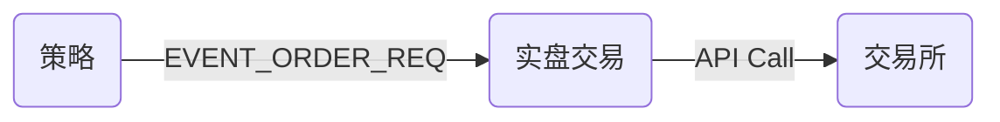
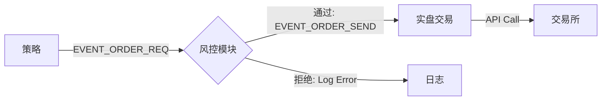

# HFT 风控模块设计文档 (Risk Management Design)

## 1. 核心理念：交易前风控 (Pre-Trade Risk Check)
风控模块充当策略与执行网关之间的**强制拦截器**。所有交易请求必须经过风控模块的批准才能发送至交易所，这是高频交易系统的最后一道防线。

## 2. 事件流架构 (Event Flow)

### 原始流程 (不安全)


### 现有流程 (安全)


## 3. 实施细节

### 3.1 框架集成 (`framework.h`)
- **EVENT_ORDER_REQ**: 代表交易**意图**（由策略生成）。
- **EVENT_ORDER_SEND**: 代表已**授权**的指令（由风控生成）。

### 3.2 模块实现 (`modules/risk/risk_module.cpp`)
#### 职责：
1.  **订阅** `EVENT_ORDER_REQ`。
2.  **流控检查 (Flow Control)**：
    - 限制每秒最大报单数 (`max_orders_per_second`)。
    - 算法：基于 `std::vector` 的滑动窗口，记录最近1秒内的报单时间戳。每次检查时清除过期时间戳，若剩余数量 >= 阈值则拒绝。
3.  **发布**：
    - **通过**: 转发事件为 `EVENT_ORDER_SEND`。
    - **拒绝**: 打印错误日志至 `stderr`，不进行转发。

### 3.3 配置文件示例 (`config.yaml`)

```yaml
plugins:
  - name: Risk_Control
    library: "../bin/libmod_risk.so"
    config:
      max_orders_per_second: "5"  # 每秒最多5单
      # price_deviation: "0.02"   # (预留) 价格偏离阈值
```

### 3.4 监控指标 (State Exposure)
未来扩展：风控模块应维护一组原子计数器（如 `rejected_count`, `current_rate`），通过共享内存快照或 Monitor 模块暴露给外部监控。

## 4. 下游配合
- **执行模块 (`modules/ctp_real`)**: 必须只订阅 `EVENT_ORDER_SEND`，严禁直接订阅 `EVENT_ORDER_REQ`。
